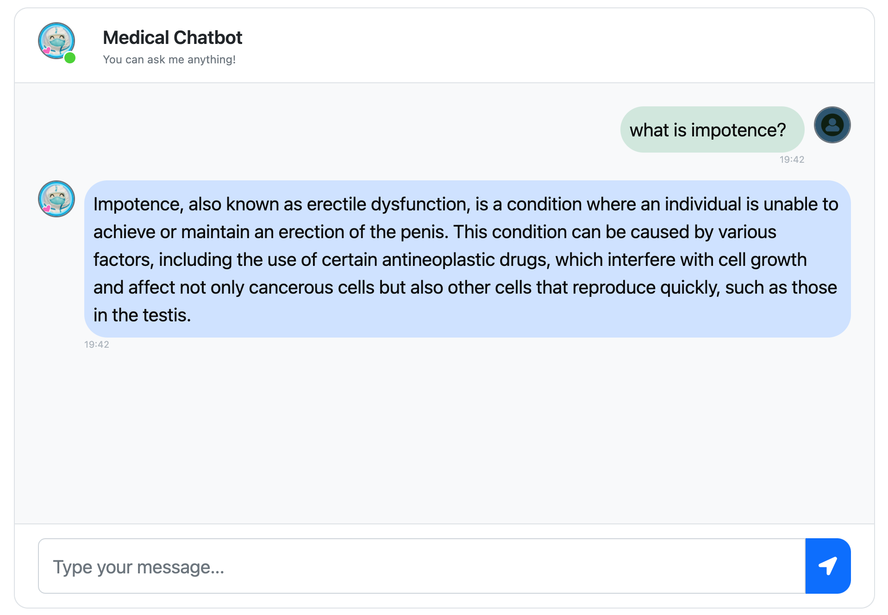

# Human-Medical-Chatbot

# Final Product looks like


# How to run?
### STEPS:

Clone the repository

```bash
Project repo: https://github.com/
```
### STEP 01- Create a conda environment after opening the repository

```bash
conda create -n medi_chatbot python=3.10 -y
```

```bash
conda activate medi_chatbot
```


### STEP 02- install the requirements

```bash
pip install -r requirements.txt
```
